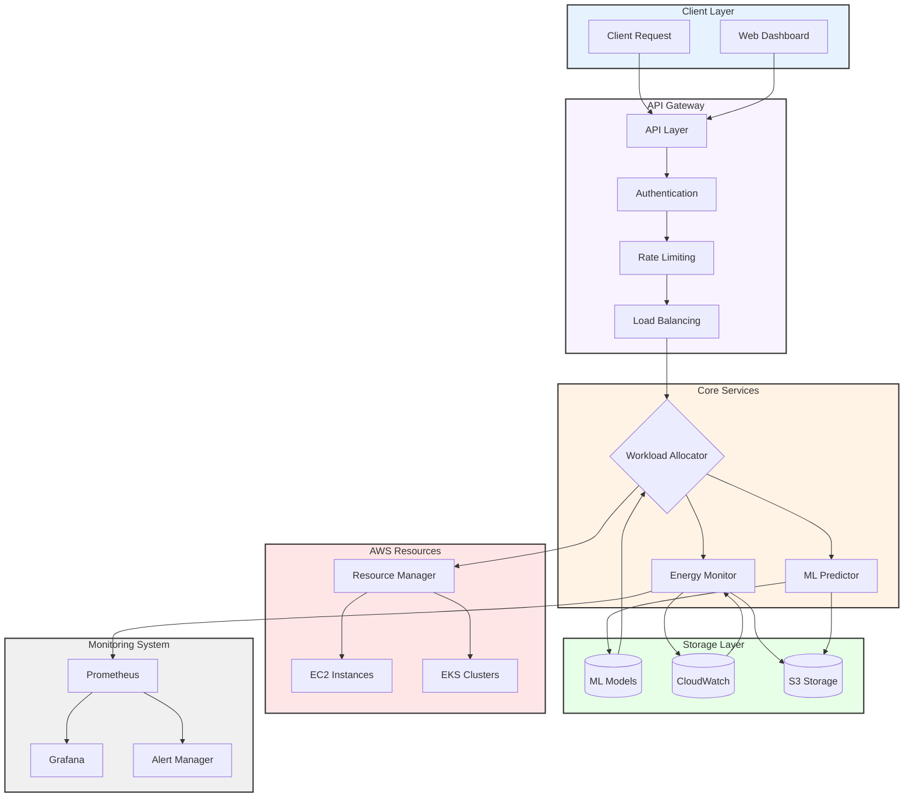
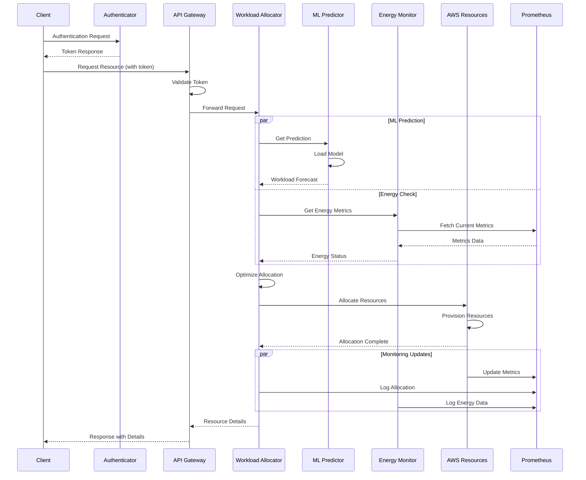
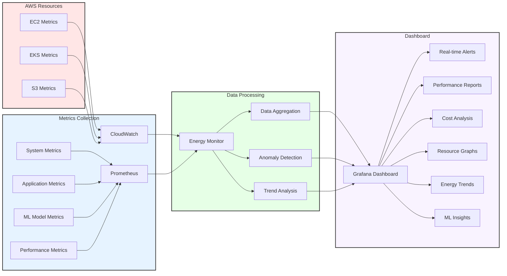
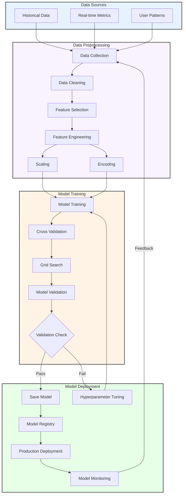
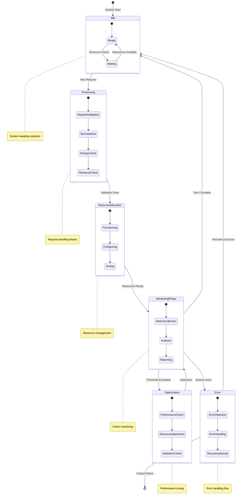

# Energy-Aware Adaptive Workload Allocation System (EAAWAS)

EAAWAS is a sophisticated system designed to optimize energy efficiency in multi-cloud environments by dynamically allocating workloads based on real-time energy metrics, workload demands, and sustainability indicators.

## Table of Contents
1. [Features](#features)
2. [System Architecture](#system-architecture)
3. [System Diagrams](#system-diagrams)
4. [Prerequisites](#prerequisites)
5. [Installation](#installation)
6. [Configuration](#configuration)
7. [Project Structure](#project-structure)
8. [Running the System](#running-the-system)
9. [Advanced Features](#advanced-features)
10. [API Endpoints](#api-endpoints)
11. [Monitoring](#monitoring)
12. [Troubleshooting](#troubleshooting)
13. [Support](#support)

## Features

### Core Features
- Real-time energy consumption monitoring
- ML-based workload prediction
- Dynamic resource allocation
- Carbon footprint tracking
- Multi-cloud support (AWS EC2 and EKS)
- REST API endpoints
- Prometheus metrics integration

### Advanced Features
- Interactive system dashboard
- Performance monitoring and analysis
- Automated testing suite
- Resource optimization
- Cost tracking and analysis
- Sustainability metrics

## System Architecture

```
+--------------------------------+
|      Client Applications       |
+--------------------------------+
              |
              | REST API
              v
+--------------------------------+
|          API Layer             |
|     (api_integration.py)       |
+--------------------------------+
         |              |
         v              v
+----------------+ +------------------+
|   Workload     | |    Energy       |
|   Allocator    | |    Monitor      |
|   (workload_   | |    (energy_     |
|   allocator.py)| |    monitoring.py)|
+----------------+ +------------------+
         |              |
         v              |
+----------------+      |
|      ML        |      |
|    Predictor   |      |
| (ml_training.py)|     |
+----------------+      |
         |             |
         v             v
+--------------------------------+
|        Data Storage            |
|  +----------------------+      |
|  |     AWS S3          |      |
|  | (Metrics Storage)   |      |
|  +----------------------+      |
|  +----------------------+      |
|  |    ML Models        |      |
|  | (Model Storage)     |      |
|  +----------------------+      |
|  +----------------------+      |
|  |   CloudWatch        |      |
|  | (Time-series Data)  |      |
|  +----------------------+      |
+--------------------------------+
```

## System Diagrams

### Data Flow


### Component Interaction


### Monitoring Pipeline


### ML Training Pipeline


### System States


### Component Details

1. **Workload Allocator**
   - Resource demand analysis
   - Energy-aware scheduling
   - Load balancing
   - Priority-based allocation

2. **Energy Monitor**
   - Real-time metrics collection
   - Carbon footprint calculation
   - Energy efficiency scoring
   - Threshold monitoring

3. **ML Predictor**
   - Workload forecasting
   - Resource usage prediction
   - Anomaly detection
   - Pattern recognition

## Prerequisites

- Python 3.8 or higher
- AWS Account with appropriate permissions
- AWS CLI installed and configured
- Docker (for containerized workloads)
- Kubernetes CLI (kubectl) for EKS integration

## Installation

1. Clone the repository:
```bash
git clone (https://github.com/Ameer1428/Project.git)
cd Project
```

2. Create and activate a virtual environment:
```bash
# Windows
python -m venv venv
.\venv\Scripts\activate

# Linux/MacOS
python -m venv venv
source venv/bin/activate
```

3. Install required dependencies:
```bash
pip install -r requirements.txt
```

4. Configure AWS credentials:
```bash
aws configure
```
Enter your AWS credentials when prompted:
- AWS Access Key ID
- AWS Secret Access Key
- Default region name (e.g., us-east-1)
- Default output format (json)

## Configuration

1. Update AWS configuration (`configs/aws_config.json`):
```json
{
    "region": "us-east-1",
    "metrics_bucket": "eaawas-metrics",
    "energy_threshold": 80,
    "monitoring_interval": 300
}
```

2. Configure ML hyperparameters (`configs/ml_hyperparameters.json`):
```json
{
    "n_estimators": 100,
    "max_depth": 10,
    "test_size": 0.2,
    "random_state": 42
}
```

## Project Structure

```
EAAWAS/
│
├── configs/                      # Configuration files
│   ├── aws_config.json         # AWS settings
│   └── ml_hyperparameters.json # ML model parameters
│
├── data/                        # Datasets
│   ├── workload_data.csv      # Historical workload data
│   └── energy_metrics.csv     # Energy consumption metrics
│
├── models/                      # Trained ML models
│   ├── workload_prediction.pkl
│   └── energy_optimization.pkl
│
├── src/                        # Source code
│   ├── ml_training.py        # ML model training
│   ├── workload_allocator.py # Workload allocation
│   ├── energy_monitoring.py  # Energy monitoring
│   └── api_integration.py    # API endpoints
│
├── dashboard/                  # Interactive dashboard
│   └── app.py               # Streamlit dashboard
│
├── tests/                      # Test suite
│   ├── test_performance.py   # Performance tests
│   └── test_stress.py       # Stress tests
│
└── logs/                       # Log files
```

## Running the System

1. Start data collection:
```bash
python scripts/collect_realtime_data.py
```

2. Train the ML model:
```bash
cd src
python ml_training.py
```

3. Start the energy monitoring service:
```bash
python energy_monitoring.py
```

4. Launch the API server:
```bash
python api_integration.py
```

5. Start the dashboard:
```bash
cd dashboard
streamlit run app.py
```

## Advanced Features

### 1. Interactive Dashboard
Access real-time insights through the dashboard:
- Resource usage heatmaps
- Energy efficiency analysis
- Workload prediction graphs
- System health monitoring
- Cost analysis

### 2. Performance Testing
Run comprehensive tests:
```bash
# All tests
pytest tests/ -v

# Stress tests
pytest tests/test_stress.py -v

# Performance tests
pytest tests/test_performance.py -v
```

### 3. Advanced Monitoring
Monitor system health:
```bash
# View Prometheus metrics
curl localhost:9090/metrics | grep eaawas

# Check logs
tail -f logs/performance.log
```

## API Endpoints

### Workload Allocation
```
POST /workload/allocate
```
Request body:
```json
{
    "cpu_request": 2.0,
    "memory_request": "4Gi",
    "priority": "high",
    "max_energy_consumption": 100.0
}
```

### Energy Metrics
```
GET /metrics/energy/{instance_id}
```

### Sustainability Metrics
```
GET /metrics/sustainability/{region}
```

## Monitoring

1. Access Prometheus metrics:
```
http://localhost:8000/metrics
```

2. View energy consumption logs:
```bash
tail -f logs/energy_logs.txt
```

3. Monitor CloudWatch metrics:
- Navigate to AWS CloudWatch console
- Check the "EAAWAS/Metrics" namespace

## Troubleshooting

1. Check application logs:
```bash
tail -f logs/allocation_logs.txt
tail -f logs/energy_logs.txt
```

2. Verify AWS connectivity:
```bash
aws sts get-caller-identity
```

3. Test API endpoints:
```bash
curl http://localhost:8000/metrics/sustainability/us-east-1
```

## Support

For support and queries:
- Contact: Ameer (ameerkhanpk1428@gmail.com)
- Create an issue in the repository
- Check the documentation
